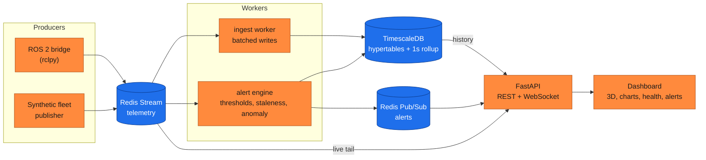

<p align="center">
  
  
  
  
  
  
  
  
  
  
  
  
</p>

# 📡 Ros Scope

**Live telemetry, health, and 3D pose for ROS 2 robot fleets — runnable with one command, no robot required.**

Ros Scope is a production-style observability platform for robot fleets. It bridges ROS 2 telemetry into a scalable time-series infrastructure and serves a live dashboard with 3D pose visualization, signal charts, per-topic health, session replay, and threshold, staleness, and anomaly alerting. The whole stack comes up with `docker compose up` and streams a synthetic fleet immediately — so you can try it without ROS installed and without hardware — then runs unchanged against a real robot via the ROS 2 bridge.

## 🎥 Dashboard


*Live fleet monitoring: robot trajectories, telemetry streams, topic health, and real-time alerts.*

## 🧠 Motivation

Modern robotic systems generate large volumes of telemetry across distributed sensors, actuators, and diagnostic channels. ROS 2 provides robust communication, but not a unified observability solution comparable to those used in cloud-native systems. Ros Scope closes that gap by applying observability principles from distributed systems to robotics: real-time fleet monitoring, historical telemetry storage, topic-health analysis, event-driven alerting, session record/replay, and hardware-independent reproducibility.

## 🏗 Architecture



The design decision worth calling out: **ingestion is separated from serving.** A Redis Stream absorbs sensor-rate bursts, a dedicated worker drains it with batched inserts, and the API only reads — so write throughput and the web tier scale independently. Full rationale in [`docs/architecture.md`](docs/architecture.md).

## 🚀 Core Features

- **Fleet monitoring** — real-time status across multiple robots, with online/offline detection and fleet-wide KPIs.
- **3D pose visualization** — live robot positions with historical trajectory trails in a shared scene.
- **Telemetry analytics** — battery, CPU temperature, and IMU signals with history backed by TimescaleDB and 1-second rollups.
- **Alert engine** — threshold rules, topic staleness/missing-data detection, and **multivariate anomaly detection** (rolling Mahalanobis distance) that flags unusual *combinations* of signals the thresholds miss.
- **Session record & replay** — bookmark a time range, then scrub through it on a timeline (play/pause/seek/speed) with the whole dashboard replaying from stored data.
- **Self-observable** — a Prometheus `/metrics` endpoint so Ros Scope can be scraped and graphed in Grafana like any production service.

## 🔌 API

| Method | Path | Purpose |
|--------|------|---------|
| GET | `/api/summary` | Fleet KPIs: robots online, active alerts, lowest battery |
| GET | `/api/robots` | Known robots with first/last-seen timestamps |
| GET | `/api/topics?robot_id=` | Topics & metrics seen for a robot |
| GET | `/api/series?robot_id=&metric=&minutes=` | Metric history (raw, or 1s rollup for long windows) |
| GET | `/api/poses?robot_id=&seconds=` | Recent pose samples |
| GET | `/api/alerts?limit=` | Most recent alerts |
| GET | `/api/health` | Per-topic observed rate and last-seen |
| POST | `/api/sessions/start` | Begin recording (bookmarks a time range) |
| POST | `/api/sessions/{id}/stop` | End a recording |
| GET | `/api/sessions` | List recorded sessions |
| GET | `/api/sessions/{id}/data` | Replay payload (pose trails, series, alerts) |
| WS | `/ws/live` | Live telemetry (stream tail) + alerts (pub/sub) |
| GET | `/metrics` | Prometheus metrics — scrape with Prometheus, graph in Grafana |

## 📈 Tech Stack

| Layer | Technologies |
|-------|--------------|
| Robotics | ROS 2 Humble, rclpy, standard `sensor_msgs` / `nav_msgs` |
| Backend | FastAPI, Uvicorn, asyncpg |
| Storage | TimescaleDB (hypertables, continuous aggregates, retention) |
| Streaming | Redis Streams (pipeline) + Redis Pub/Sub (alerts) |
| Frontend | Three.js (3D pose), µPlot (charts), vanilla ES — no build step |
| Observability | Prometheus `/metrics` |
| Infrastructure | Docker Compose, multi-service, health-gated startup |
| Testing | Pytest, Ruff, GitHub Actions CI |

## ▶️ Quick Start

No robot and no ROS install required — the default stack runs a synthetic fleet.

```bash
git clone https://github.com/ATemova/ros-scope.git
cd ros-scope
docker compose up --build
```

Open **http://localhost:8000**. Within a few seconds you'll see three robots streaming, trails drawing in 3D, and the first alerts arriving as the simulated batteries drain and one robot's `/scan` topic drops out.

### Feeding real ROS 2 data

The `ros` profile starts the rclpy bridge plus a small demo publisher so you can verify the ROS path end to end:

```bash
docker compose --profile ros up --build
```

The bridge subscribes to `/battery_state`, `/imu`, `/odom`, and `/diagnostics` and forwards them into the same pipeline. Point it at your own robot or a Gazebo bringup by replacing the demo publisher.

## 🧪 Development & Quality

Lint and the full test suite run with no containers — the rule engine, schema, simulator, anomaly detector, and metrics formatter are pure and infra-free, which keeps CI fast:

```bash
pip install -r requirements-dev.txt
ruff check .
pytest -q                  # 22 tests
```

CI runs lint and tests as separate jobs on every push. See [`CONTRIBUTING.md`](CONTRIBUTING.md) and [`CHANGELOG.md`](CHANGELOG.md).

## 🛠 Engineering Decisions

A few choices that make this more than a toy, and what they buy:

- **Stream buffer, not direct DB writes.** Redis Streams decouple producers from storage and survive a worker restart via consumer groups, so no samples are lost during a redeploy.
- **Batched `COPY` ingestion.** The ingest worker accumulates samples and writes them with `copy_records_to_table`, dramatically cheaper than row-by-row inserts at sensor rates.
- **Continuous aggregate for history.** Charts over long windows read a 1-second rollup instead of raw rows, keeping payloads small and queries fast; raw data has a 7-day retention policy.
- **Staleness as a first-class signal.** "No data" is often the most important alert in robotics — the engine tracks last-seen time per topic and fires when a stream goes quiet, not just on bad values.
- **Anomalies beyond thresholds.** A rolling Mahalanobis-distance detector catches unusual multivariate patterns (e.g. a CPU-temperature blip that never crosses the hard limit).
- **Interchangeable producers.** A shared envelope means the synthetic publisher and the ROS 2 bridge are drop-in replacements — which is what lets the project demo with zero hardware.
- **Self-observable.** A Prometheus `/metrics` endpoint exposes ingest rate, active alerts, anomalies, and fleet KPIs, so the observability platform is itself observable.

## 📁 Project Layout

```
common/   shared telemetry envelope + logging helper (used by every service)
sim/      synthetic fleet publisher  (default data source)
bridge/   ROS 2 rclpy bridge + demo bot  (profile: ros)
ingest/   Redis stream -> TimescaleDB worker
alerts/   threshold, staleness + anomaly rule engine
api/      FastAPI: REST, /ws/live, /metrics, static dashboard
api/static/  the dashboard (Three.js + µPlot)
db/       TimescaleDB schema + continuous aggregate
tests/    unit tests: rules, schema, simulator, anomaly, metrics
```

## 🎯 Outcome

Ros Scope demonstrates how observability principles from modern distributed systems apply to robotic fleets: a reproducible environment for monitoring, analyzing, and diagnosing robot behavior, compatible with both simulated and real-world deployments. It serves as both a portfolio reference architecture and a practical starting point for telemetry-driven robotic observability.

## License

MIT — see [LICENSE](LICENSE).